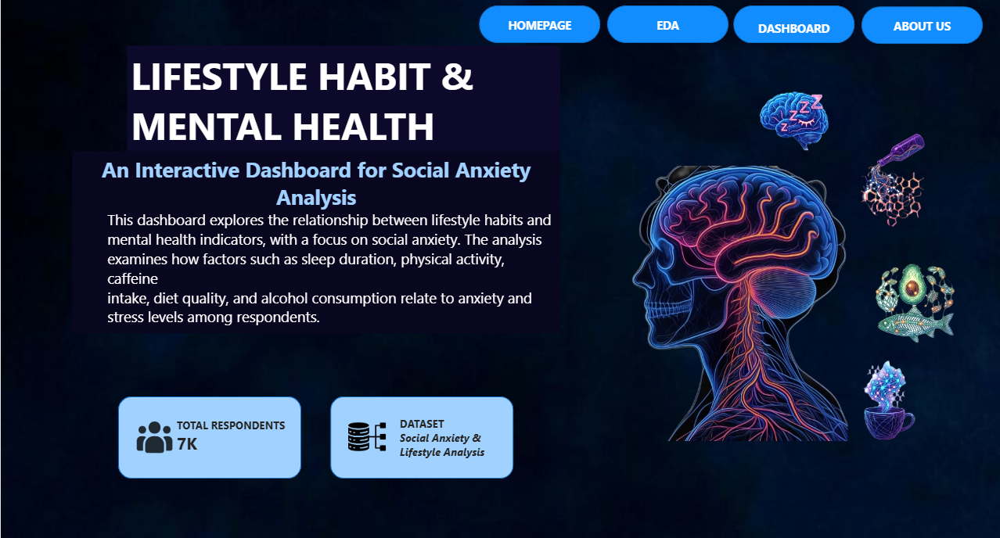
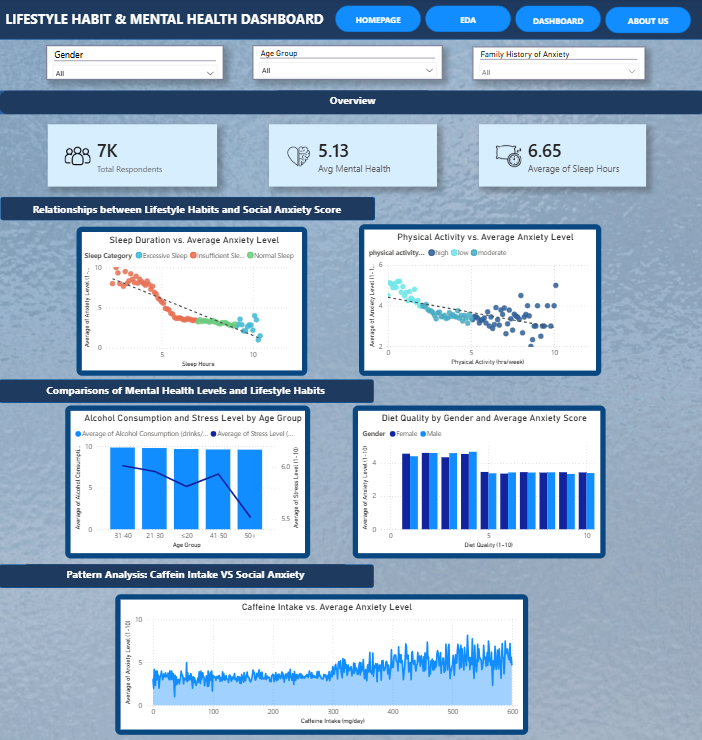
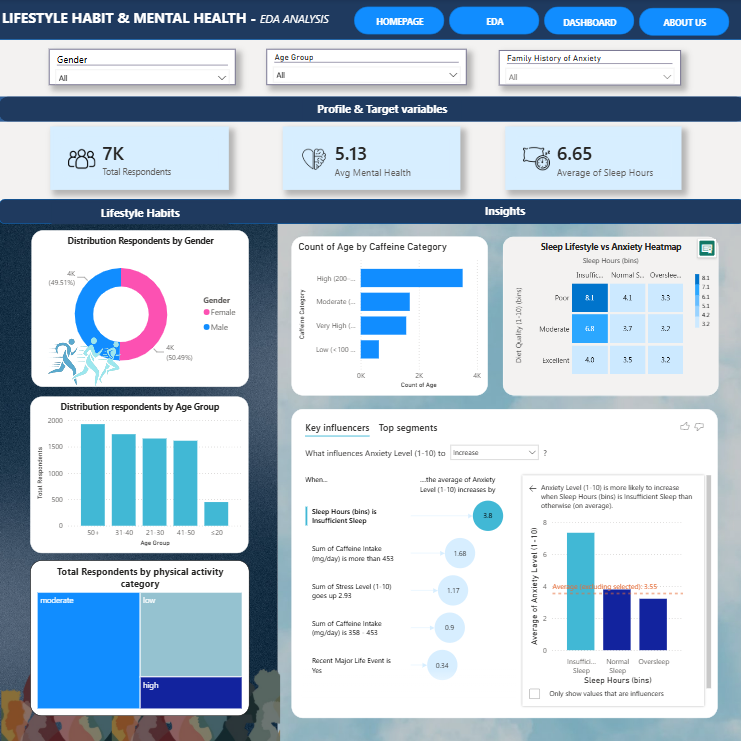

# Lifestyle Habits & Mental Health Dashboard

### An Interactive Dashboard for Social Anxiety Analysis

## Project Overview

This project presents an interactive Power BI dashboard that explores relationships between lifestyle habits and mental health indicators, with a focus on social anxiety.

The analysis examines how sleep duration, physical activity, caffeine intake, diet quality and alcohol consumption relate to respondents’ anxiety and stress levels.

This dashboard was developed as a **seven-member group project** for the DSC651-Data Representation and Reporting Techniques.

## Homepage

The homepage introduces the dashboard.

## Project Objectives

* Explore relationships between lifestyle habits and social anxiety.
* Determine how sleep and physical activity relate to anxiety levels.
* Compare alcohol consumption and stress across age groups.
* Examine diet quality and anxiety scores by gender.
* Analyse patterns between caffeine intake and anxiety.
* Communicate the findings through an interactive and user-friendly dashboard.

## Final Dashboard

## Dashboard Overview

The dashboard contains three summary indicators:

| Indicator                   |     Result |
| --------------------------- | ---------: |
| Total Respondents           |         7K |
| Average Mental Health Score |       5.13 |
| Average Sleep Duration      | 6.65 hours |

## Interactive Filters

Users can filter the dashboard by:

* Gender
* Age group
* Family history of anxiety

These filters allow users to explore how lifestyle habits and mental health indicators vary across different respondent groups.

## Dashboard Analysis

### 1. Sleep Duration vs. Average Anxiety Level

This visual analyses the relationship between respondents’ sleep duration and average anxiety level. Sleep duration is grouped into:

* Insufficient sleep
* Normal sleep
* Excessive sleep

The visual indicates a downward relationship between sleep duration and average anxiety. Respondents with shorter sleep durations generally display higher average anxiety levels, while longer sleep durations are associated with lower anxiety levels.

### 2. Physical Activity vs. Average Anxiety Level

This scatter plot examines the relationship between weekly physical activity and average anxiety.

The overall trend suggests that respondents with greater levels of physical activity generally report lower average anxiety. However, variations between individual respondents are still present.

### 3. Alcohol Consumption and Stress Level by Age Group

This combination chart compares average alcohol consumption and average stress levels across different age groups.

It allows users to assess whether age groups with higher alcohol consumption also demonstrate higher stress levels. The comparison shows that the relationship varies across age categories.

### 4. Diet Quality by Gender and Average Anxiety Score

This chart compares average anxiety scores across diet-quality ratings for male and female respondents.

It enables users to examine whether anxiety patterns differ by gender and whether better diet quality is associated with changes in average anxiety levels.

### 5. Caffeine Intake vs. Average Anxiety Level

This visual analyses the pattern between daily caffeine intake and average anxiety.

The chart suggests that average anxiety tends to become higher and more variable at greater caffeine-intake levels, particularly among respondents with the highest reported intake.

## Key Findings

* Shorter sleep durations are associated with higher average anxiety levels.
* Average anxiety generally decreases as sleep duration increases.
* Higher physical activity is generally associated with lower average anxiety.
* Alcohol consumption and stress levels vary across different age groups.
* Anxiety patterns across diet-quality ratings are relatively similar between male and female respondents.
* Higher caffeine intake is associated with greater variation and a general increase in average anxiety.
* Mental health outcomes may be influenced by a combination of lifestyle and demographic factors.

> These findings represent associations within the analysed dataset. They should not be interpreted as medical diagnoses or evidence that one factor directly causes another.

## Exploratory Data Analysis

Exploratory data analysis was conducted before developing the final dashboard to:

* Understand the dataset’s variables and distributions.
* Identify patterns between lifestyle habits and mental health indicators.
* Compare anxiety and stress across different respondent groups.
* Select appropriate variables for the final analysis.
* Determine suitable chart types for communicating the findings.
* Support the overall data story presented in the dashboard.

## Chart Selection and Justification

| Analysis                              | Chart type                   | Justification                                                                             |
| ------------------------------------- | ---------------------------- | ----------------------------------------------------------------------------------------- |
| Sleep duration and anxiety            | Scatter plot with trend line | Shows the relationship and overall direction between two numerical variables.             |
| Physical activity and anxiety         | Scatter plot with trend line | Reveals patterns, variation and the relationship between activity and anxiety.            |
| Alcohol consumption and stress by age | Combination chart            | Compares alcohol consumption while displaying changes in stress levels across age groups. |
| Diet quality, gender and anxiety      | Clustered column chart       | Supports comparisons between male and female respondents across diet-quality scores.      |
| Caffeine intake and anxiety           | Line chart                   | Displays the pattern and variation in anxiety across increasing caffeine-intake values.   |
| Summary indicators                    | KPI cards                    | Highlights the most important dataset-level figures immediately.                          |
| Demographic exploration               | Slicers                      | Allows users to filter and compare results across different respondent groups.            |

## Dashboard Design

The dashboard was designed with:

* A consistent blue colour scheme
* Clear section headings
* Interactive navigation buttons
* Structured visual hierarchy
* KPI cards for important summary values
* Consistent chart formatting
* Demographic filters positioned at the top
* Separate sections for relationships, comparisons and pattern analysis

## My Contributions

My primary contributions to the project included:

* Contributed to designing and developing the Power BI dashboard.
* Conducted exploratory data analysis to identify relevant patterns and relationships.
* Helped select appropriate chart types for the dashboard.
* Provided justifications for chart selections based on the variables and analytical objectives.
* Contributed to the user-interface design, including the layout, navigation, colour consistency and visual hierarchy.
* Helped organise the analysis into relationship, comparison and pattern-analysis sections.
* Collaborated with six other team members to communicate the findings through an effective data story.

## Tools and Skills

* Microsoft Power BI
* RapidMiner
* Exploratory data analysis
* Data visualisation
* Dashboard development
* Chart selection and justification
* User-interface design
* Data storytelling
* Team collaboration

## How to View the Dashboard

1. Download `lifestyle_social_anxiety_dashboard.pbix` from the `dashboard` folder.
2. Open it using Microsoft Power BI Desktop.
3. Use the gender, age-group and family-history slicers to explore the analysis.

## Project Role

**Khadijah Sofia Anuar**
Dashboard Design, Exploratory Data Analysis, Chart Selection and UI Design
Bachelor of Computer Science (Hons.), specialising in Big Data
Universiti Teknologi MARA (UiTM)

## Acknowledgement

This repository showcases my individual contributions to a seven-member group project. Credit for the complete project is shared among all team members.
